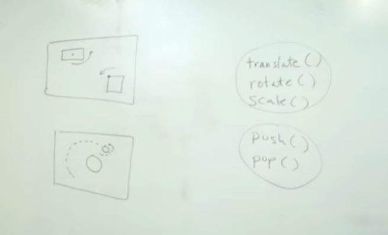

##### 9.12: Local Server, Text Editor, JavaScript Console
Main thing to study in this chapter is to study about
`translate()`, `rotate()`, `scale()`, and also about `push()`,`pop()`.



```javascript

```
```javascript

```
```javascript

```
-[`video to study...`](https://www.youtube.com/watch?v=o9sgjuh-CBM&list=PLRqwX-V7Uu6ZmA-d3D0iFIvgrB5_7kB8H)