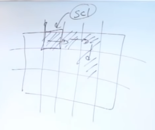

#### The Snake game first part

```javascript
let s;

function setup (){
  createCanvas(600, 600);
  s = new Snake();
}

function draw(){
background(51);
s.update();
s.show();
}

function Snake(){
  this.x = 0;
  this.y = 0;
  this.xSpeed = 1;
  this.ySpeed = 0;

  this.update = function() {
    this.x = this.x + this.xSpeed;
    this.y = this.y + this.ySpeed;
  }

  this.show= function (){
    fill(255);
    rect(this.x, this.y, 10, 10);
  }

}
```

```javascript
function keyPressed(){
  if(keyCode === UP_ARROW){
    s.dir(0, -1);
  }else if (keyCode === DOWN_ARROW){
   s.dir (0,1);
   }}else if (keyCode === RIGHT_ARROW){
   s.dir (1,0);
   }}else if (keyCode === LEFT_ARROW){
   s.dir (-1,0);
   }
}
```
to add the scale (snake size become bigger)every time it eat one rect.



```javascript
let s;
let scl = 20;

function setup (){
  createCanvas(700, 700);
  s = new Snake();
  frameRate(10);// farm rate make it slower and look like snake game
}

function draw(){
background(51);
s.update();
s.show();
}
function keyPressed(){
  if(keyCode === UP_ARROW){
    s.dir(0, -1);
  }else if (keyCode === DOWN_ARROW){
   s.dir (0,1);
   }else if (keyCode === RIGHT_ARROW){
   s.dir (1,0);
   }else if (keyCode === LEFT_ARROW){
   s.dir (-1,0);
   }
}

function Snake(){
  this.x = 0;
  this.y = 0;
  this.xSpeed = 1;
  this.ySpeed = 0;

  this.dir = function (x, y){
    this.xSpeed = x;
    this.ySpeed = y;
  }

  this.update = function() {
    this.x = this.x + this.xSpeed * scl;
    this.y = this.y + this.ySpeed * scl;

    this.x = constrain(this.x, 0, width - scl); // it will not go out of the page by X 
    this.y = constrain(this.y, 0, height - scl);// it will keep it inside canvas on Y 
  }
  this.show = function (){
    fill(255);
    rect(this.x, this.y, scl, scl);
  }

}
```
Creating food for the snake to eat
```javascript

let s;
let scl = 20;
let food;

function setup (){
  createCanvas(700, 700);
  s = new Snake();
  frameRate(10);
  food = createVector(random(width), random(height));//creating a Vector for food on random positions.
}

function draw(){
background(51);
s.update();
s.show();

fill (255, 0, 100); // fill the color for food to red ish
rect(food.x, food.y, scl, scl);// size as per the snake.
}

function keyPressed(){
  if(keyCode === UP_ARROW){
    s.dir(0, -1);
  }else if (keyCode === DOWN_ARROW){
   s.dir (0,1);
   }else if (keyCode === RIGHT_ARROW){
   s.dir (1,0);
   }else if (keyCode === LEFT_ARROW){
   s.dir (-1,0);
   }
}

function Snake(){
  this.x = 0;
  this.y = 0;
  this.xSpeed = 1;
  this.ySpeed = 0;

  this.dir = function (x, y){
    this.xSpeed = x;
    this.ySpeed = y;
  }

  this.update = function() {
    this.x = this.x + this.xSpeed * scl;
    this.y = this.y + this.ySpeed * scl;

    this.x = constrain(this.x, 0, width - scl);
    this.y = constrain(this.y, 0, height - scl);
  }
  this.show = function (){
    fill(255);
    rect(this.x, this.y, scl, scl);
  }

}

```
if the snake eat the food select a new location for food and place it there.
```javascript
let s;
let scl = 20;
let food;

function setup (){
  createCanvas(700, 700);
  s = new Snake();
  frameRate(10);// farm rate make it slower and look like snake game
  pickLocation();
}

function pickLocation (){
  let cols = floor(width/scl);
  let rows = floor(height/scl);
  food = createVector(floor(random(cols)), floor(random(rows)));
  food.mult(scl);
}

function draw(){
background(51);
s.update();
s.show();

if (s.eat(food)){// if the snake eat the food pick the new location.
  pickLocation();
}
fill (255, 0, 100);
rect(food.x, food.y, scl, scl);
}

function keyPressed(){
  if(keyCode === UP_ARROW){
    s.dir(0, -1);
  }else if (keyCode === DOWN_ARROW){
   s.dir (0,1);
   }else if (keyCode === RIGHT_ARROW){
   s.dir (1,0);
   }else if (keyCode === LEFT_ARROW){
   s.dir (-1,0);
   }
}

function Snake(){
  this.x = 0;
  this.y = 0;
  this.xSpeed = 1;
  this.ySpeed = 0;

  this.eat = function (pos){ // writing the function if the snake eat the food.
    let d = dist (this.x, this.y, pos.x, pos.y);
    if (d < 1){
      return true;
    }else{
      return false;
    }
  }

  this.dir = function (x, y){
    this.xSpeed = x;
    this.ySpeed = y;
  }

  this.update = function() {
    this.x = this.x + this.xSpeed * scl;
    this.y = this.y + this.ySpeed * scl;

    this.x = constrain(this.x, 0, width - scl); // it will not go out of the page by X 
    this.y = constrain(this.y, 0, height - scl);// it will keep it inside canvas on Y 
  }
  this.show = function (){
    fill(255);
    rect(this.x, this.y, scl, scl);
  }

}

 ```
below code will make error after snake start to eat the second food or increases by second rect
 ```javascript 
 let s;
let scl = 20;
let food;

function setup (){
  createCanvas(700, 700);
  s = new Snake();
  frameRate(10);// farm rate make it slower and look like snake game
  pickLocation();
}

function pickLocation (){// writing this function is just to put a random place for food in the canvas.
  let cols = floor(width/scl);
  let rows = floor(height/scl);
  food = createVector(floor(random(cols)), floor(random(rows)));
  food.mult(scl);
}

function draw(){
background(51);
s.update();
s.show();

if (s.eat(food)){// if the snake eat the food pick the new location.
  pickLocation();
}
fill (255, 0, 100); // here we draw the food with red color.
rect(food.x, food.y, scl, scl);// the rect (food) size is as per snake size.
}

function keyPressed(){
  if(keyCode === UP_ARROW){
    s.dir(0, -1);
  }else if (keyCode === DOWN_ARROW){
   s.dir (0,1);
   }else if (keyCode === RIGHT_ARROW){
   s.dir (1,0);
   }else if (keyCode === LEFT_ARROW){
   s.dir (-1,0);
   }
}

function Snake(){
  this.x = 0;
  this.y = 0;
  this.xSpeed = 1;
  this.ySpeed = 0;

  this.total = 0; // to make the lent of the snake longer
  this.tail =[]; //tail should be an empty array after eating every food it will add one object in it.


  this.eat = function (pos){ // writing the function if the snake eat the food.
    let d = dist (this.x, this.y, pos.x, pos.y);
    if (d < 1){
      this.total ++; // if it eat food total should go high by 1
      return true;
    }else{
      return false;
    }
  }

  this.dir = function (x, y){
    this.xSpeed = x;
    this.ySpeed = y;
  }

  this.update = function() {
  for (let i = 0; i <this.tail.length -1; i++){
    this.tail[i] = this.tail[i + 1];// this will take the part of tail and shift it to a side while making place for other rect to be added in snake tail.
  }
  this.tail[this.total - 1] = createVector (this.x, this.y);
  }

    this.tail[this.total -1] = createVector(this.x, this.y);// this will allow the current location and after it move

    this.x = this.x + this.xSpeed * scl;
    this.y = this.y + this.ySpeed * scl;

    this.x = constrain(this.x, 0, width - scl); // it will not go out of the page by X 
    this.y = constrain(this.y, 0, height - scl);// it will keep it inside canvas on Y 
  }
  this.show = function (){

    for(let i = 0; i < this.total; i++){
      rect(this.tail[i].x, this.tail[i].y, scl, scl);
    }
    
    rect(this.x, this.y, scl, scl);
  }

}
 
 ```