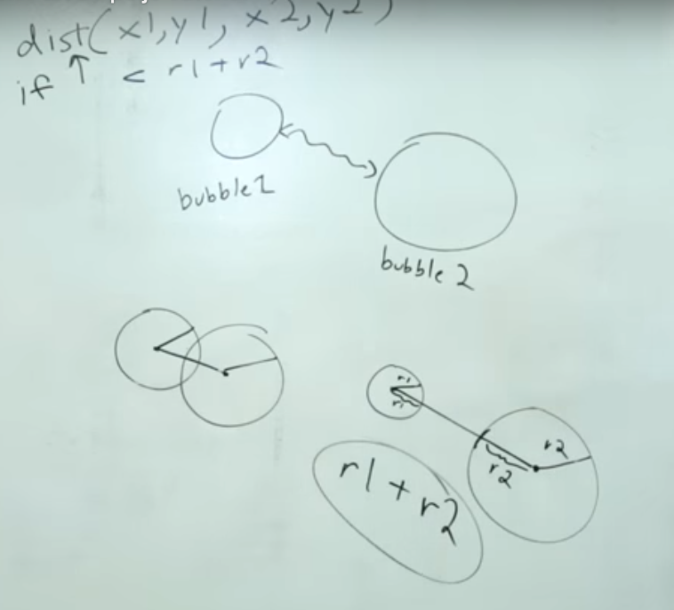

#### Object Communication part 1 - P5-JS.

>This page covers how to determine if two circles are overlapping (intersecting) in a p5.js sketch. The functionality is demonstrated with an object-oriented approach.

**If we** have two circle A1 & A2, to know if they are overleaping each other or not, we just have to know if the distance between radius A1 & A2 circle, if it is less then they A1 & A2 is overleaping, if it is more then they are not overleaping.



```javascript
let bubble1;
let bubble2;

function setup(){
    createCanvas(600, 600);
    bubble1 = new Bubble(200, 200, 50);
    bubble2 = new Bubble(300, 200, 50);
}

function draw(){// if bubble1 distance with bubble2 is grater the background will be black
    background(0); 
    let d = dist (bubble1.x, bubble1.y, bubble2.x, bubble2.y);
    if (d < bubble1.s + bubble2.s){
        background(200,0,100); // if bubble1 is overlapping bubble2 background will be change.
    }
    bubble1.object1();
    bubble1.move();
    bubble2.object1();
    bubble2.move();
}

class Bubble {
    
    constructor(tempX, tempY, tempS = 30){
        this.x = tempX;
        this.y = tempY;
        this.s = tempS; 
        this.brightness = 0;
    }
    
    object1(){
        stroke(255);
        strokeWeight(3);
        noFill();
        fill(this.brightness, 100); 
        ellipse(this.x, this.y, this.s * 2);
    }
    
    changeColor(bright){
        this.brightness = bright;
    }
    
    rollover(px, py){
        
        let d = dist(px, py, this.x, this.y);
        if (d < this.s){
            return true;
        }else{
            return false;
        }
    }
    
    move(){  
        this.x = this.x + random (-5, 5);
        this.y = this.y + random (-5, 5);
}
}
```
**If we** can try the same idea with the function `intersects(){}` in side the class.
```javascript

function draw(){
    background(0);

    // we are calling intersects from class to show in draw function.
    if (bubble1.intersects(bubble2)){
         background(200,0,100);
    }
    
    bubble1.object1();
    bubble1.move();
    bubble2.object1();
    bubble2.move();
}
    
    intersects (other){
    return true;
    } // it always be red color as the function is always true.

     intersects (other){
    return false;
    } // in this case the background will be always black as it is false.
    
```
**Now** if we want to not just draw onw bubble but many bubbles can we change this code to replace bubble1 with `this` and bubble2 with `other`, also we can write function of `intersects` to show intersection of all bubbles.
```javascript
let bubble1;
let bubble2;

function setup(){
    createCanvas(600, 600);
    bubble1 = new Bubble(200, 200, 50);
    bubble2 = new Bubble(300, 200, 50);
}

function draw(){
    background(0);

    if (bubble1.intersects(bubble2)){
         background(200,0,100);
    }
    bubble1.object1();
    bubble1.move();
    bubble2.object1();
    bubble2.move();
}
class Bubble {
    
    constructor(tempX, tempY, tempS = 30){
        this.x = tempX;
        this.y = tempY;
        this.s = tempS; 
        this.brightness = 0;
    }
    object1(){
        stroke(255);
        strokeWeight(3);
        noFill();
        fill(this.brightness, 100); 
        ellipse(this.x, this.y, this.s * 2);
    }
    intersects (other){// comparing the same function we wrote in draw function before
    // by just changing bubble1 with this and bubble2 with other.
        let d = dist (this.x, this.y, other.x, other.y);
        if (d < this.s + other.s){
        return true;
        }else{
            return false;
        }
    }
    changeColor(bright){
        this.brightness = bright;
    }
    
    rollover(px, py){
        
        let d = dist(px, py, this.x, this.y);
        if (d < this.s){
            return true;
        }else{
            return false;
        }
    }
    move(){  
        this.x = this.x + random (-5, 5);
        this.y = this.y + random (-5, 5);
}
}
```
we can also make the code shorter by just asking to return the true of false of this statement.

```javascript

intersects (other){
        let d = dist (this.x, this.y, other.x, other.y);
        return (d < this.s + other.s);

```
