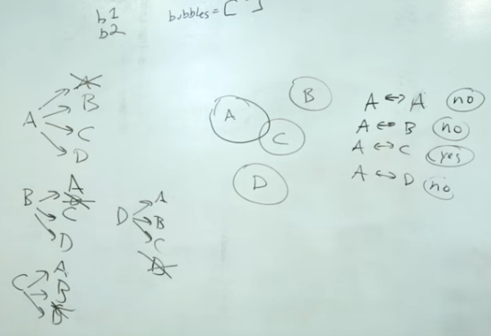
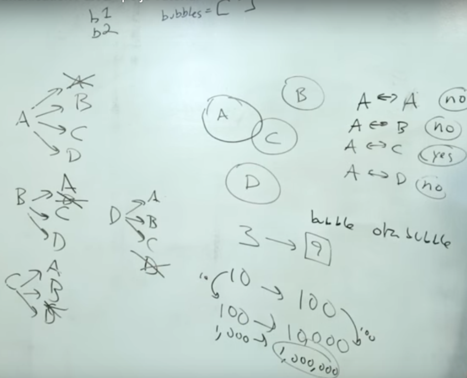

#### Object Communication part2 - P5-JS.

>In this we can  explore shape intersection with object-oriented programming. Here, we demonstrate how to use a nested loop to check every object's position against every other object.

**If we** have an array of object, how can we check if 0 object in array intersect 1, 2, 3, 4, etc objects or not. 


```javascript
// both below for is calling same loop.
for (let i = 0 ; i < bubbles.length; i++){
  bubbles[i].show();
  bubbles[i].move()
}
// below is also calling a loop which is new in 
// javascript ES6.
for (b of bubbles){
  b.objects();
  b.move();
}
```
In this example we control the intersect of bubbles by making new object `afBubble` and assign `bubbles` array to `for (b of bubbles) { }` further more we are attaching `afBubble` to `mouseX` and `mouseY`.
```javascript
let bubbles = [];
let afBubble;
function setup(){
    createCanvas(600, 600);
    for (let i = 0; i < 10; i++){
        let x = random(width);
        let y = random(height);
        let s = random (10, 50);
        bubbles[i]= new Bubble(x, y, s);
    }
    afBubble = new Bubble(300, 300, 30);
}

function draw(){
    background(0);
    
    afBubble.x = mouseX;
    afBubble.y = mouseY;
    afBubble.object1();
    afBubble.move();

    for (b of bubbles){
    b.object1()
    b.move()
        if (afBubble.intersects(b)){
            b.changeColor(255);
        }else{// if the bubbles array intersects with afBubbles change color else don't.
            b.changeColor(0);
        }
    }
}

class Bubble {
    
    constructor(tempX, tempY, tempS = 30){
        this.x = tempX;
        this.y = tempY;
        this.s = tempS; 
        this.brightness = 0;
    }
    
    object1(){
        stroke(255);
        strokeWeight(3);
        noFill();
        fill(this.brightness, 100); 
        ellipse(this.x, this.y, this.s * 2);
    }
    
    intersects (other){
        let d = dist (this.x, this.y, other.x, other.y);
        return (d < this.s + other.s);
    }
    
    changeColor(bright){
        this.brightness = bright;
    }
    
    rollover(px, py){
        
        let d = dist(px, py, this.x, this.y);
        if (d < this.s){
            return true;
              }else{
                  return false;
              }
    }
    
    move(){  
        this.x = this.x + random (-5, 5);
        this.y = this.y + random (-5, 5);
}
}
```
**If we** write as below, it is going to work but we have to find a way to change the color back to normal. 
```javascript
function draw(){
    background(0);

    for (b of bubbles){
        b.object1()
        b.move()
        // all the other bubbles in array is included in this loop.
        for (other of bubbles){
          // the two bubbles which intersects each others are included in this section.
          // like A & E but not B, C, D, F
            if (b !== other && b.intersects(other)){/* in this b is not equal to others but 
            intersects others which can be any bubble in Array.*/
                b.changeColor(255);
                    }
                }
        }
}
```
**Before** changing color we need to check, if they are overlapping or not.
```javascript
function draw(){
    background(0);

    for (b of bubbles){
        b.object1()
        b.move()
        let overLapping = false;// at the moment it is not ture event one time overlapping
        for (other of bubbles){
            if (b !== other && b.intersects(other)){
                overLapping = true;// if overlapping once.
                }
            }
    // once overlapping is checked, follow the change of color or not.
        if (overLapping){
            b.changeColor(255);
              }else{
                  b.changeColor(0);
            }
      }
}
```

```javascript
```