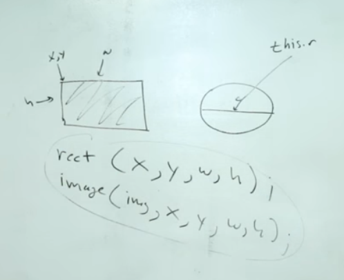
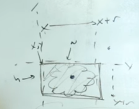

#### Object and Images - P5-JS

```javascript
let bubbles = [];

let picture;

function preload(){
    picture = loadImage('flower.png');
}

function setup(){
    createCanvas(600, 600);
    for (let i = 0; i < 10; i++){
    let x = random(width)
    let y = random(height)
    let r = random(10, 50)
    let b = new Bubble(x, y, r);
    bubbles.push(b);
    }
}

function draw(){
    background(0);
    for (let i = 0; i < bubbles.length; i++){
        bubbles[i].object1();
        bubbles[i].move();
    }
}

class Bubble {
    
    constructor(tempX, tempY, tempS){
        this.x = tempX;
        this.y = tempY;
        this.s = tempS; 
        this.brightness = 0;
    }
    
    object1(){
        
        image(picture, this.x, this.y, 40, 50);
        
//        stroke(255);
//        strokeWeight(3);
//        fill(this.brightness, 125);
//        ellipse(this.x, this.y, this.s * 2);
    }

    move(){
        this.x = this.x + random (-5, 5);
        this.y = this.y + random (-5, 5);
}
}
```
**To** change the size we can assign `this.s` to its wight and height as we allocate to `rect()`.
.

**To** change this single picture to an `array` of picture the setup will be someway like below.

```javascript
/* one way is to do like below but for every image we have to
write different line*/

let carooton = [];

function preload(){
    cartoon[0] = loadImage('cartoon/cartoon00.jpg');
    cartoon[0] = loadImage('cartoon/cartoon01.jpg');
    cartoon[0] = loadImage('cartoon/cartoon02.jpg');
    cartoon[0] = loadImage('cartoon/cartoon03.jpg');
}
```
**There** are some better way to make this `loop`, if we have some random way of naming our pictures, in this case (cartoon00, cartoon01, cartoon02) and so on.

Here we follow the below formula 
```javascript
2 + 3   = 5

'A' + 'B' = 'AB'
'Dog'+'Head'= 'DogHead'
```
Following above we can write below code.
```javascript
let bubbles = [];

let cartoon = [];

function preload(){
    // to loop different cartoon picture in array
    for(i = 0; i < 9; i++){
        // cartoon pictures are in folder called cartoon
    cartoon[i] = loadImage('cartoonFolder/cartoon'+ i +'.jpg');
    }
    
}

function setup(){
    createCanvas(800, 800);
    for (let i = 0; i < 10; i++){
    let x = random(width)
    let y = random(height)
    let r = random(30, 80)
    let b = new Bubble(x, y, r);
    bubbles.push(b);
    }
}

function draw(){
    background(0);
    for (let i = 0; i < bubbles.length; i++){
        bubbles[i].object1();
        bubbles[i].move();
    }
}
class Bubble {
    
    constructor(tempX, tempY, tempS){
        this.x = tempX;
        this.y = tempY;
        this.s = tempS; 

    }
    
    object1(){
        // you can change cartoon[number], to get every time new cartoon.
        image(cartoon[9], this.x, this.y, this.s, this.s);
    }

    
    move(){
        this.x = this.x + random (-5, 5);
        this.y = this.y + random (-5, 5);
}
}
```
**To** select random cartoon picture from the loop and show it in class and object we need below setup.
```javascript
let bubbles = [];

let cartoons = [];

function preload(){

    for(i = 0; i < 9; i++){
    cartoons[i] = loadImage('cartoonFolder/cartoon'+ i +'.jpg');
    }
    
}

function setup(){
    createCanvas(800, 800);
    for (let i = 0; i < 10; i++){
    let x = random(width);
    let y = random(height);
    let r = random(30, 80);
    let picture = random(cartoons);// taking cartoons from function preload
    let b = new Bubble(x, y, r, picture);
    bubbles.push(b);
    }
}


function draw(){
    background(0);
    for (let i = 0; i < bubbles.length; i++){
        bubbles[i].object1();
        bubbles[i].move();
    }
}

class Bubble {
    
    constructor(tempX, tempY, tempS, img){
        this.x = tempX;
        this.y = tempY;
        this.s = tempS;
        this.cartoon = img;// object is reciving cartoon from setup and putting it as property for object1.
    }
    
    object1(){
        
        image(this.cartoon, this.x, this.y, this.s, this.s);
        // here we have to pass this.cartoon from class as this.x, y, or s to work.
    }
    
    move(){
        this.x = this.x + random (-5, 5);
        this.y = this.y + random (-5, 5);
}
}
```
> On previews codes we use `ellipse ()` for find the radies for mouse to click but here we are almost working with `rect()`,



```javascript
( px > this.x && px < this.x + this.s && py > this.y && py < this.y + this.s )

```
Code can be as below.

```javascript
let bubbles = [];

let cartoons = [];

function preload(){

    for(i = 0; i < 9; i++){
    cartoons[i] = loadImage('cartoonFolder/cartoon'+ i +'.jpg');
    }
    
}

function setup(){
    createCanvas(800, 800);
    for (let i = 0; i < 10; i++){
    let x = random(width);
    let y = random(height);
    let r = random(50, 80);
    let picture = random(cartoons);
    let b = new Bubble(x, y, r, picture);
    bubbles.push(b);
    }
}


function mousePressed() {
        for (let i = 0; i < bubbles.length; i++){
        bubbles[i].clicked(mouseX, mouseY);
    }
}

function draw(){
    background(0);
    for (let i = 0; i < bubbles.length; i++){
        bubbles[i].object1();
        bubbles[i].move();
    }
}

class Bubble {
    
    constructor(tempX, tempY, tempS, img){
        this.x = tempX;
        this.y = tempY;
        this.s = tempS;
        this.cartoon = img;
    }
    
    object1(){
        
        image(this.cartoon, this.x, this.y, this.s, this.s);
    }
    
        clicked(px, py) {
        if (px > this.x && px < this.x + this.s && py > this.y && py < this.y + this.s) {
          this.cartoon = random(cartoons);
        }
    }
    
    move(){
        this.x = this.x + random (-5, 5);
        this.y = this.y + random (-5, 5);
}
}
```
**By** clicking not to change to new cartoon picture, but to a new picture out of an Array.

```javascript
let bubbles = [];

let flower;
let cartoons = [];

function preload(){
    flower = loadImage('cartoonFolder/flower.png');
    for(i = 0; i < 9; i++){
    cartoons[i] = loadImage('cartoonFolder/cartoon'+ i +'.jpg');
    }
}

function setup(){
    createCanvas(800, 800);
    for (let i = 0; i < 50; i++){
    let x = random(width);
    let y = random(height);
    let r = random(50, 80);
    // let picture = random(cartoons); // also possible not to pass in setup but in class and object.
    let b = new Bubble(x, y, r);
    bubbles.push(b);
    }
}
function mousePressed() {
        for (let i = 0; i < bubbles.length; i++){
        bubbles[i].clicked(mouseX, mouseY);
    }
}

function draw(){
    background(0);
    for (let i = 0; i < bubbles.length; i++){
        bubbles[i].object1();
        bubbles[i].move();
    }
}

class Bubble {
    
    constructor(tempX, tempY, tempS, img){
        this.x = tempX;
        this.y = tempY;
        this.s = tempS;
        this.cartoon = random(cartoons);// just to put random option in here.
    }
    
    object1(){
        image(this.cartoon, this.x, this.y, this.s, this.s);
    }
    
        clicked(px, py) {
        if (px > this.x && px < this.x + this.s && py > this.y && py < this.y + this.s) {
          this.cartoon = flower;//random(cartoons);// after clicking not to change to different cartoon but it should change to new flower picture.
        }
    }
    
    move(){
        this.x = this.x + random (-5, 5);
        this.y = this.y + random (-5, 5);
}
}
```

